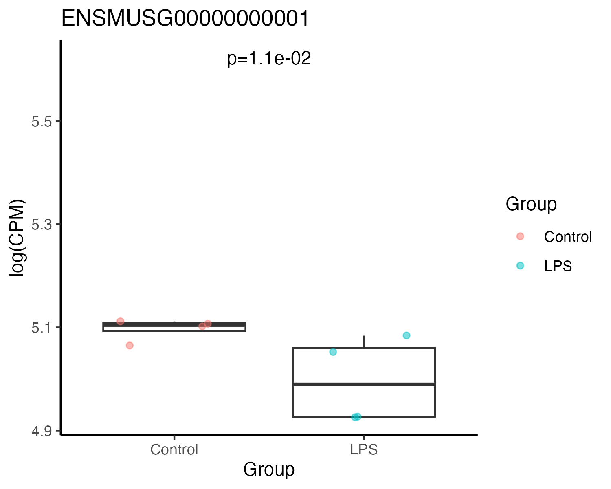

## RNA-seq practical

Follow the steps below to make a box plot to visualise the expression of
your gene of interest.

### Step 1

Check if tidyverse is installed and if not, install it:

    if(!require("tidyverse")) install.packages("tidyverse")

### Step 2:

Load the package:

### Step 3

Make a function to create the boxplot:

    make_boxplot <- function(dat, gene, fdr) {
      
      dat <- dat %>%
        filter(gene_id == gene) %>%
        select(contains("CPM")) %>%
        pivot_longer(cols = everything()) %>%
        mutate(group = ifelse(grepl("C_", name), "Control", "LPS"))
      
      ann <- tibble(x = 1.5,
                    y = 1.1 * log1p(max(dat$value)),
                    label = paste0("p=", scales::scientific(fdr)))
      
      ggplot(dat, aes(x = group, y = log1p(value))) +
        geom_boxplot(outlier.shape = NA) +
        geom_jitter(aes(colour = group, fill = group), pch = 21, alpha = 0.5) +
        labs(title = gene, x = "Group", y = "log(CPM)", colour = "Group", fill = "Group") +
        theme_classic() +
        geom_text(data = ann, aes(x = x, y = y, label = label))
      
    }

### Step 4

Import the differential expression analysis table:

    dat <- read_delim("lps_dea_table.csv")

### Step 5

Example boxplot using the gene ENSMUSG00000000001:

    make_boxplot(dat = dat, gene = "ENSMUSG00000000001", fdr = 0.011)

